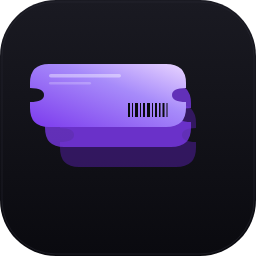

# 🎫 TicketVault

Desktopová aplikace pro správu inventáře vstupenek pro přeprodej. Sleduje nákupy, prodeje, profit, ROI a statistiky.



## ✨ Funkce

- 📊 **Dashboard** s přehledem profitu, utracení, revenue a statusu vstupenek
- 📈 **Statistiky** s grafy (profit po měsících, rozdělení podle platforem, top eventy)
- 🔍 **Filtrování** podle statusu, měsíce, roku, data a textu
- ✏️ **CRUD operace** - přidání, úprava, prodej a mazání vstupenek
- 📥📤 **Export/Import** ve formátu JSON (zálohy) a CSV (Excel)
- 👥 **Sdílení s kamarádem** — dvě možnosti:
  - **Online režim** (Netlify Functions + Blobs) — plně online databáze zdarma
  - **Sdílená složka** (OneDrive, Dropbox, Google Drive) — offline-first
- 🌙 **Tmavý theme** s fialovými akcenty

## 🚀 Instalace

### Varianta A: Stáhnout hotový installer

Pokud máš `.exe` installer:
1. Spusť `TicketVault-Setup-1.0.0.exe`
2. Projdi instalačního průvodce
3. Aplikace se nainstaluje do Start menu a na desktop

### Varianta B: Buildnout si vlastní installer

**Předpoklady:**
- [Node.js 18+](https://nodejs.org/) (LTS verze)
- Windows 10/11

**Postup:**

```bash
# 1. Rozbalit zip nebo naklonovat projekt
cd ticketvault

# 2. Instalace závislostí
npm install

# 3. Spustit aplikaci (bez instalace)
npm start

# 4. Vytvořit Windows installer
npm run build:win
```

Hotový installer najdeš ve složce `dist/`:
- `TicketVault-Setup-1.0.0.exe` — klasický installer
- `TicketVault-Portable-1.0.0.exe` — portable verze (nevyžaduje instalaci)

## 👥 Sdílení databáze s kamarádem

TicketVault nabízí **dva způsoby sdílení** — vyber si, co ti víc sedí:

### ☁️ Způsob 1: Online režim (doporučeno)

Plně online databáze přes **Netlify Functions + Blobs** — zdarma, bez cloud složek.

1. Rozjeď backend: viz `ticketvault-backend/README.md` (trvá 3 minuty)
2. V aplikaci: `Nastavení` → `☁️ Online režim`
3. Zadej API URL a klíč, klikni `Testovat připojení` → `Uložit`
4. Zapni přepínač — všechny změny se teď automaticky ukládají online
5. Kamarád zadá stejnou URL + klíč a vidí stejná data

**Výhody:**
- Žádná potřeba OneDrive/Dropbox
- Data jsou vždy aktuální
- Funguje odkudkoliv
- Lokální cache funguje i když cloud nedostupný

### 📁 Způsob 2: Sdílená cloudová složka

TicketVault ukládá data do **jednoho JSON souboru**. Pro sdílení stačí:

1. **Nainstaluj si cloudové úložiště**, které synchronizuje soubory:
   - OneDrive (doporučeno - vestavěné ve Windows)
   - Dropbox
   - Google Drive (desktop klient)
   - Nebo síťový disk

2. **V aplikaci**: Klikni na `Nastavení` → `Změnit umístění`

3. **Vyber složku v cloudu**, např.:
   ```
   C:\Users\MenoUzivatele\OneDrive\TicketVault\ticketvault-db.json
   ```

4. **Kamarád si nainstaluje aplikaci a nastaví stejnou sdílenou složku** (musíš mu dát k ní přístup)

5. **Při spuštění aplikace klikněte na `Synchronizovat`** — automaticky se načte aktuální verze databáze

### ⚠️ Upozornění

- Pokud oba editují databázi současně, jeden z nich přepíše druhého (last-write-wins)
- Doporučujeme pravidelně dělat **JSON zálohy** přes `Nastavení` → `Exportovat zálohu`
- Před editací je dobré spustit `Synchronizovat`, abys měl nejnovější data

## 💾 Zálohy

### Export zálohy
`Nastavení` → `📤 Exportovat zálohu` — vytvoří kompletní JSON zálohu celé databáze.

### Import zálohy
`Nastavení` → `📥 Importovat zálohu` — nabídne možnosti:
- **Sloučit** — přidá nové záznamy k existujícím
- **Přepsat** — smaže stávající data a nahradí je ze zálohy

### CSV pro Excel
Export/Import CSV umožňuje editovat data v Excelu nebo Google Sheets.

## ⌨️ Klávesové zkratky

- `Ctrl + N` — Nová vstupenka
- `Ctrl + E` — Export databáze
- `Ctrl + I` — Import databáze
- `Ctrl + ,` — Nastavení
- `Esc` — Zavřít modal

## 📁 Kde jsou uložená data?

Defaultní umístění: `%APPDATA%\TicketVault\ticketvault-db.json`

Aplikace si automaticky tvoří zálohy (`.backup` soubor) před každým zápisem.

## 🛠️ Technické info

- **Electron** 28+ (desktop runtime)
- **Čisté HTML/CSS/JS** (žádné React dependencies)
- **Chart.js** (via CDN) pro grafy
- **JSON databáze** pro snadné sdílení a editaci

## 📝 Licence

MIT
